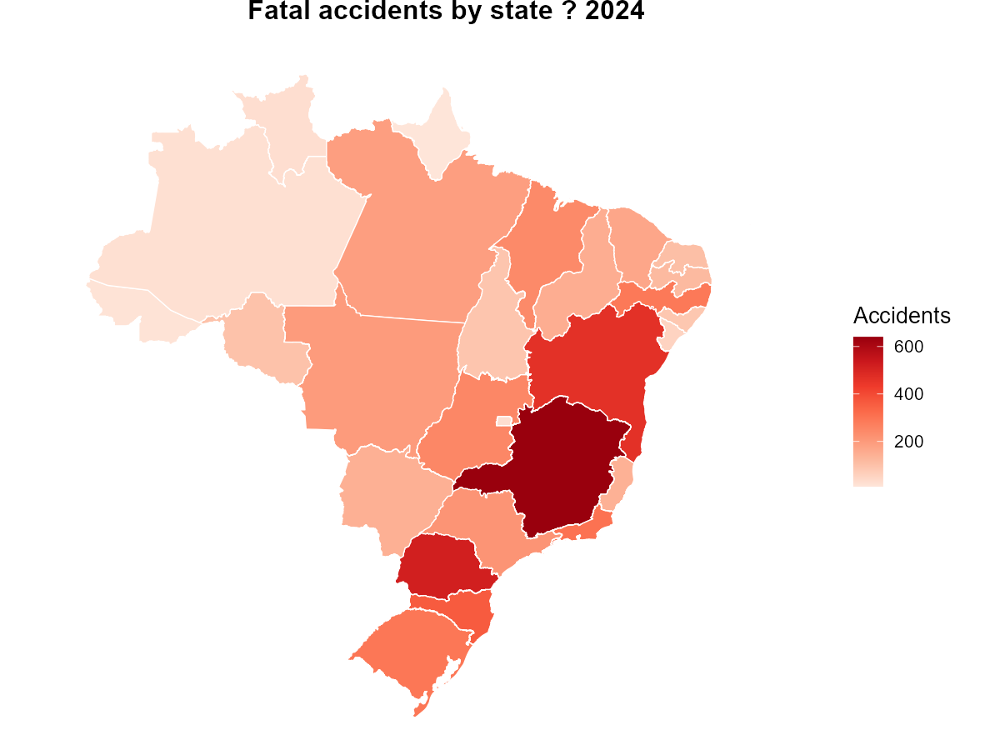

# tidyprf 

<!-- badges: start -->
[](https://lifecycle.r-lib.org/articles/stages.html#experimental)
[](https://github.com/bonijoao/tidyprf/actions/workflows/R-CMD-check.yaml)
<!-- badges: end -->

*[Leia em Português](README.pt-br.md)*

**tidyprf** gives you direct access to Brazilian Federal Highway Police (PRF)
road safety data — traffic accidents by person, accidents by occurrence, and
traffic violations — all from within R. No manual downloads, no navigating
government portals: just pick a dataset, choose the year, and get a clean,
analysis-ready tibble.

Data is distributed as Parquet files via GitHub Releases and cached locally
after the first download.

## Quick example

Map fatal accidents across Brazilian states in 2024:

```r
library(tidyprf)
library(geobr)
library(dplyr)
library(ggplot2)

fatal <- get_crashes(2024, severity = "fatal") |>
  count(uf, name = "acidentes")

read_state(year = 2020, showProgress = FALSE) |>
  left_join(fatal, by = c("abbrev_state" = "uf")) |>
  ggplot() +
  geom_sf(aes(fill = acidentes), color = "white", linewidth = 0.3) +
  scale_fill_distiller(palette = "Reds", direction = 1, name = "Accidents") +
  labs(title = "Fatal accidents by state (2024)") +
  theme_void(base_size = 13) +
  theme(plot.title = element_text(hjust = 0.5, face = "bold"))
```



## Installation

Install the development version from GitHub:

```r
# install.packages("remotes")
remotes::install_github("bonijoao/tidyprf")
```

## Datasets

| Dataset | Function | Unit | Available Years |
|---|---|---|---|
| Accidents by person | `get_accidents()` | 1 row per person | 2007–2026 |
| Accidents by occurrence | `get_crashes()` | 1 row per accident | 2007–2026 |
| Traffic violations | `get_violations()` | 1 row per violation | 2019–2020, 2022–2026 |

All three functions support filtering by:
- `uf` — state abbreviation(s), e.g. `"SP"`, `c("SP", "RJ")`
- `br` — federal highway number(s), e.g. `101`, `116`
- `severity` — `"fatal"`, `"injured"`, or `"no_victims"` (accidents only)

Use `info_accidents()`, `info_crashes()`, or `info_violations()` to see all
variable descriptions in English or Portuguese.

## Cache

Parquet files are cached locally after first download:

```r
prf_cache()               # show cached files and sizes
prf_cache_clear()         # delete all cached files
prf_years("accidents")    # available years and row counts per dataset
```

## License

MIT
